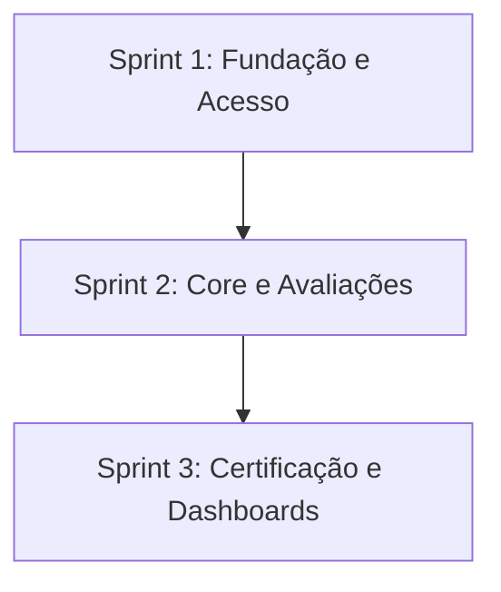

# Portal de Certificação em Metodologias Ágeis (SCRUM)

## 📌 Descrição do Desafio

O aprendizado de metodologias ágeis, especialmente o framework Scrum, é um pilar fundamental na formação de desenvolvedores de software. No entanto, os estudantes frequentemente enfrentam dificuldades para consolidar conceitos teóricos como papéis, rituais e artefatos, além de sentirem falta de uma forma estruturada para medir sua evolução.

**A Dor:** A ausência de uma ferramenta prática que permita validar o conhecimento de forma gamificada e progressiva. Este portal resolve essa lacuna ao oferecer um ambiente de certificação interna por níveis, integrando tecnologias web modernas e persistência de dados.

---

## 📋 Backlog de Produto

O backlog foi organizado para atender aos requisitos funcionais (RF) e não funcionais (RNF) priorizando um MVP funcional.

|    ID    | User Story                                                                                                                                                       | Requisitos Relacionados  | Sprint |
| :------: | ---------------------------------------------------------------------------------------------------------------------------------------------------------------- | :----------------------: | :----: |
| **US00** | Infraestrutura, Banco de Dados e Documentação Técnica                                                                                                            | RNF05, RNF06, RP02, RP04 |   1    |
| **US01** | **Cadastro de Usuário**: Como novo usuário, quero me cadastrar no portal fornecendo CPF, nome, e-mail e senha para acessar as avaliações.                        |       RF01, RNF03        |   1    |
| **US02** | **Autenticação Segura**: Como usuário cadastrado, quero realizar login com CPF e senha para manter meu progresso salvo.                                          |       RF02, RNF04        |   1    |
| **US04** | **Realização de Avaliação por Nível**: Como usuário, quero realizar provas de 10 questões (com mix de dificuldades) para validar meu conhecimento em cada nível. |     RF03, RF04, RF05     |   2    |
| **US05** | **Gestão de Tentativas e Notas**: Como usuário, quero ter até 2 tentativas por nível, com o sistema retendo minha melhor nota para o cálculo final.              |     RF06, RF07, RF08     |   2    |
| **US07** | **Auditoria de Histórico**: Como sistema, devo registrar a data/hora e questões de cada tentativa para fins de auditoria.                                        |           RF10           |   2    |
| **US03** | **Visualização de Progresso**: Como estudante, quero consultar meu progresso, níveis concluídos e notas para saber quanto falta para minha certificação.         |       RF11, RNF01        |   3    |
| **US06** | **Emissão de Certificado**: Como usuário aprovado, quero gerar um certificado em PDF com meus dados e média final para comprovar minha competência.              |           RF09           |   3    |

---

## ⏳ Cronograma de Evolução

O projeto é desenvolvido em ciclos de 3 semanas, conforme o cronograma oficial.



### Tabela Descritiva das Sprints

|             Período              |           Documentação da Sprint           |
| :------------------------------: | :----------------------------------------: |
| **Sprint 1:** 13/04 a 30/04/2026 | [Documentação Sprint 1](./docs/sprint1.md) |
| **Sprint 2:** 04/05 a 21/05/2026 | [Documentação Sprint 2](./docs/sprint2.md) |
| **Sprint 3:** 25/05 a 11/06/2026 | [Documentação Sprint 3](./docs/sprint3.md) |

---

## 🛠️ Tecnologias Utilizadas

O projeto respeita as restrições técnicas de não utilizar frameworks no front-end e garantir persistência robusta:

- **Front-end:** HTML5, CSS3 e JavaScript (Puro/Vanilla).
- **Back-end:** Node.js para exposição de APIs.
- **Banco de Dados:** PostgreSQL (Uso de DDL e DML explícitos).
- **Segurança:** Autenticação via JWT e criptografia de senhas com Scrypt.
- **Design:** Figma para prototipação e Astah para diagramação UML.

---

<!-- ## 📂 Estrutura do Projeto
A organização das pastas segue as definições do servidor e scripts de inicialização:
```text
├── src/
│   ├── database/       # Conexão com PostgreSQL (db.js)
│   ├── infra/          # Scripts de inicialização (run-sql.js e SQLs)
│   ├── middlewares/    # Middleware de autenticação JWT
│   ├── repositories/   # Camada de persistência (consultas SQL)
│   ├── routes/         # Definição dos endpoints da API
│   ├── utils/          # Funções de JWT e Password Hash
│   └── server.js       # Ponto de entrada do servidor Node.js
├── public/             # Front-end: HTML, CSS e JS (Puro)
├── docs/               # Documentação (DoR, DoD, Diagramas, Manual)
├── .env                # Configurações sensíveis (não versionado)
└── README.md
```

--- -->

## 🚀 Como Executar o Projeto

### Pré-requisitos

- Node.js instalado.
- Banco de Dados PostgreSQL ativo e configurado.

### Instalação e Inicialização

1. Clone o repositório e instale as dependências:
   ```bash
   npm install
   ```
2. Configure o arquivo `.env` na raiz do projeto seguindo o modelo:
   ```env
   PORT=3000
   POSTGRES_HOST=localhost
   POSTGRES_USER=seu_usuario
   POSTGRES_PASSWORD=sua_senha
   POSTGRES_DB=abp
   JWT_SECRET=sua_chave_secreta
   ```
3. Inicialize as tabelas do banco de dados e a carga de dados inicial:
   ```bash
   npm run db:init
   ```
4. Execute o servidor:
   ```bash
   npm run dev
   ```

---

## 👥 Equipe

| <a href="https://github.com/PatyMaidana"></a><br>**Patricia Maidana** | <a href="https://github.com/michelrubens"></a><br>**Michel Rubens** |
| :-----------------------------------------------------------------------------------------------------------------------------: | :----------------------------------------------------------------------------------------------------------------------------: |
|                                                       Product Owner (PO)                                                        |                                                          Scrum Master                                                          |
|            [LinkedIn](https://www.linkedin.com/in/patricia-rosa-maidana) • [GitHub](https://github.com/PatyMaidana)             |                [LinkedIn](https://www.linkedin.com/in/michelrubens) • [GitHub](https://github.com/michelrubens)                |

### Dev Team

|                                                                                                          | Integrante                       | Papel     |                                                  Contatos                                                   |
| :------------------------------------------------------------------------------------------------------: | :------------------------------- | :-------- | :---------------------------------------------------------------------------------------------------------: |
|    <a href="https://github.com/ThiagoDT/"></a>     | **Thiago Dias Francisco**        | Developer |                                   [GitHub](https://github.com/ThiagoDT/)                                    |
| <a href="https://github.com/igorcsouzaa/"></a>  | **Igor Corrêa de Souza**         | Developer |  [LinkedIn](https://www.linkedin.com/in/igor-correa-de-souza/) • [GitHub](https://github.com/igorcsouzaa/)  |
|     <a href="https://github.com/phjsilva"></a>     | **Pedro Henrique Jose da Silva** | Developer |    [LinkedIn](http://www.linkedin.com/in/pedro-silva-3b5869380) • [GitHub](https://github.com/phjsilva)     |
| <a href="https://github.com/portug4lucas"></a> | **Lucas Portugal Alves**         | Developer | [LinkedIn](http://www.linkedin.com/in/lucas-portugal-09263b362) • [GitHub](https://github.com/portug4lucas) |
|   <a href="https://github.com/Victorhubb"></a>   | **Victor Gomes Coelho**          | Developer |  [LinkedIn](https://www.linkedin.com/in/victor-gomes-699051404/) • [GitHub](https://github.com/Victorhubb)  |
| <a href="https://github.com/ViniciusGuin"></a> | **Vinicius Guin Okabe Kenmochi** | Developer |                                  [GitHub](https://github.com/ViniciusGuin)                                  |

---

## 📝 Padrão de Commits e Branches

Para garantir a rastreabilidade com o **GitHub Projects** e as **Issues**, adotamos os seguintes padrões:

### Commits

As mensagens devem referenciar o ID da Issue com `#`:

- `tipo (#id_issue): descrição clara`
- _Exemplo:_ `feat (#1): implementar hash de senha no cadastro`

### Branches

As branches devem ser criadas a partir de uma Issue:

- `tipo/id_issue-descrição-breve`
- _Exemplo:_ `feat/1-hash-senha`

**Tipos permitidos:**

| Tipo           | Descrição                                                              |
| :------------- | :--------------------------------------------------------------------- |
| **`feat`**     | Adição de um novo recurso ou funcionalidade.                           |
| **`fix`**      | Correção de um erro ou bug.                                            |
| **`docs`**     | Alterações apenas na documentação (ex: README).                        |
| **`style`**    | Ajustes de formatação, lint, pontos e vírgulas, etc.                   |
| **`refactor`** | Mudanças no código que não alteram a funcionalidade (ex: performance). |
| **`test`**     | Criação, alteração ou exclusão de testes unitários.                    |
| **`chore`**    | Mudanças em build, configurações, pacotes ou `.gitignore`.             |
| **`cleanup`**  | Limpeza de código (remover comentários ou trechos inúteis).            |
| **`remove`**   | Exclusão de arquivos, diretórios ou funções obsoletas.                 |

---

### 🔗 Links Importantes

- [Pasta de Documentação](./docs) (Contém Checklists de DoR/DoD).
