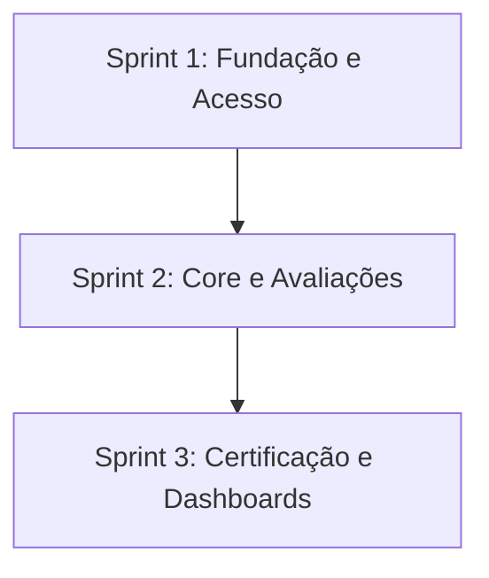

# Portal de Certificação em Metodologias Ágeis (SCRUM)

## 📌 Descrição do Desafio

O aprendizado de metodologias ágeis, especialmente o framework Scrum, é um pilar fundamental na formação de desenvolvedores de software. No entanto, os estudantes frequentemente enfrentam dificuldades para consolidar conceitos teóricos como papéis, rituais e artefatos, além de sentirem falta de uma forma estruturada para medir sua evolução.

**A Dor:** A ausência de uma ferramenta prática que permita validar o conhecimento de forma gamificada e progressiva. Este portal resolve essa lacuna ao oferecer um ambiente de certificação interna por níveis, integrando tecnologias web modernas e persistência de dados.

---

## 📋 Backlog de Produto

O backlog foi organizado para atender aos requisitos funcionais (RF) e não funcionais (RNF) priorizando um MVP funcional.

|    ID    | User Story                                            | Requisitos Relacionados  | Sprint |
| :------: | ----------------------------------------------------- | :----------------------: | :----: |
| **US00** | Infraestrutura, Banco de Dados e Documentação Técnica | RNF05, RNF06, RP02, RP04 |   1    |
| **US01** | Cadastro de Usuário (CPF, Nome, E-mail, Senha)        |       RF01, RNF03        |   1    |
| **US02** | Autenticação Segura via JWT e Hash de Senha           |       RF02, RNF04        |   1    |
| **US04** | Motor de Avaliação (10 questões aleatórias 3F/4M/3D)  |     RF03, RF04, RF05     |   2    |
| **US05** | Gestão de Tentativas (Limite de 2) e Melhor Nota      |     RF06, RF07, RF08     |   2    |
| **US07** | Registro de Histórico e Auditoria de Exames           |           RF10           |   2    |
| **US03** | Dashboard de Progresso do Estudante                   |       RF11, RNF01        |   3    |
| **US06** | Geração de Certificado Final em PDF                   |           RF09           |   3    |

---

## ⏳ Cronograma de Evolução

O projeto é desenvolvido em ciclos de 3 semanas, conforme o cronograma oficial.



<!-- ### Tabela Descritiva das Sprints
| Período | Documentação da Sprint | Vídeo de Demonstração |
|:---:|:---:|:---:|
| **Sprint 1:** 13/04 a 30/04/2026 | [Documentação Sprint 1](./docs/sprint1) | [Assistir no Youtube](https://youtube.com/...) |
| **Sprint 2:** 04/05 a 21/05/2026 | [Documentação Sprint 2](./docs/sprint2) | [Assistir no Youtube](https://youtube.com/...) |
| **Sprint 3:** 25/05 a 11/06/2026 | [Documentação Sprint 3](./docs/sprint3) | [Assistir no Youtube](https://youtube.com/...) |

--- -->

## 🛠️ Tecnologias Utilizadas

O projeto respeita as restrições técnicas de não utilizar frameworks no front-end e garantir persistência robusta:

- **Front-end:** HTML5, CSS3 e JavaScript (Puro/Vanilla).
- **Back-end:** Node.js para exposição de APIs.
- **Banco de Dados:** PostgreSQL (Uso de DDL e DML explícitos).
- **Segurança:** Autenticação via JWT e criptografia de senhas com Scrypt.
- **Design:** Figma para prototipação e Astah para diagramação UML.

---

<!-- ## 📂 Estrutura do Projeto
A organização das pastas segue as definições do servidor e scripts de inicialização:
```text
├── src/
│   ├── database/       # Conexão com PostgreSQL (db.js)
│   ├── infra/          # Scripts de inicialização (run-sql.js e SQLs)
│   ├── middlewares/    # Middleware de autenticação JWT
│   ├── repositories/   # Camada de persistência (consultas SQL)
│   ├── routes/         # Definição dos endpoints da API
│   ├── utils/          # Funções de JWT e Password Hash
│   └── server.js       # Ponto de entrada do servidor Node.js
├── public/             # Front-end: HTML, CSS e JS (Puro)
├── docs/               # Documentação (DoR, DoD, Diagramas, Manual)
├── .env                # Configurações sensíveis (não versionado)
└── README.md
```

--- -->

## 🚀 Como Executar o Projeto

### Pré-requisitos

- Node.js instalado.
- Banco de Dados PostgreSQL ativo e configurado.

### Instalação e Inicialização

1. Clone o repositório e instale as dependências:
   ```bash
   npm install express dotenv bcryptjs
   ```
2. Configure o arquivo `.env` na raiz do projeto seguindo o modelo:
   ```env
   PORT=3000
   POSTGRES_HOST=localhost
   POSTGRES_USER=seu_usuario
   POSTGRES_PASSWORD=sua_senha
   POSTGRES_DB=abp
   JWT_SECRET=sua_chave_secreta
   ```
3. Inicialize as tabelas do banco de dados e a carga de dados inicial:
   ```bash
   npm run db:init
   ```
4. Execute o servidor:
   ```bash
   npm run dev
   ```

---

<!-- ## 👥 Equipe
*   **Nome Completo 1** - [GitHub](...) - **Papel:** Design Digital (Figma/UI).
*   **Nome Completo 2** - [GitHub](...) - **Papel:** Engenharia de Software (UML).
*   **Nome Completo 3** - [GitHub](...) - **Papel:** Banco de Dados (PostgreSQL).
*   **Nome Completo 4** - [GitHub](...) - **Papel:** Back-end (Segurança/API).
*   **Nome Completo 5** - [GitHub](...) - **Papel:** Back-end (Infra/Scripts).
*   **Nome Completo 6** - [GitHub](...) - **Papel:** Front-end (Cadastro).
*   **Nome Completo 7** - [GitHub](...) - **Papel:** Front-end (Login/Dashboard).
*   **Nome Completo 8** - [GitHub](...) - **Papel:** Gestão Git e Qualidade (DoR/DoD).

--- -->

## 📝 Padrão de Commits e Branches

Para garantir a rastreabilidade com o **GitHub Projects** e as **Issues**, adotamos os seguintes padrões:

### Commits

As mensagens devem referenciar o ID da Issue com `#`:
`tipo (#id_issue): descrição clara`
_Exemplo:_ `feat (#1): implementar hash de senha no cadastro`

### Branches

As branches devem ser criadas a partir de uma Issue:
`tipo/id_issue-descrição-breve`
_Exemplo:_ `feat/1-hash-senha`

**Tipos permitidos:** `feat`, `fix`, `docs`, `style`, `refactor`, `test`, `chore`.

---

### 🔗 Links Importantes

- [Pasta de Documentação](./docs) (Contém Checklists de DoR/DoD).
